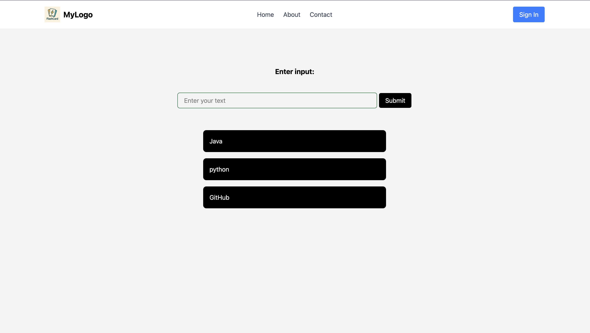

# Propress Report for Sprint One

The frontend (React, Tailwind, TypeScript) has been connected to the backend (Python, FastAPI, Supabase).
The user can prompt the OpenAI API via the input field to create a set of flashcards.
The flashcards are added to the database and associated with the current user_id.

