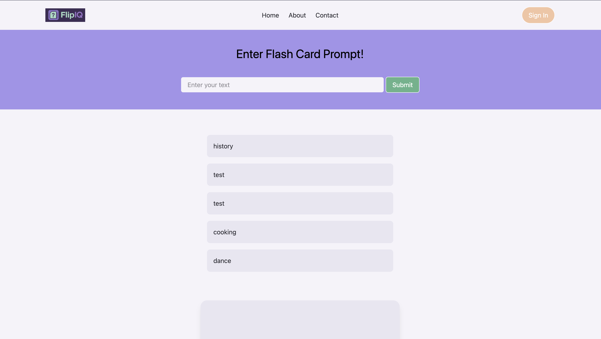
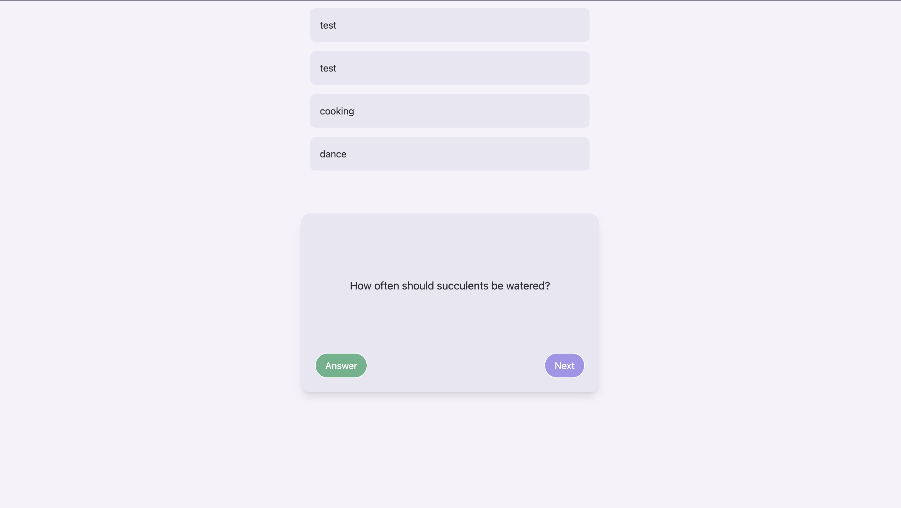

# Current Progress

The frontend (React, Tailwind, TypeScript) is now fully integrated with the backend (Python, FastAPI, Supabase).
Users can enter a prompt, which is sent to the OpenAI API to generate a flashcard set.
Each generated set is saved to the database and linked to the current user’s ID.
Flashcard sets are displayed in an animated list, allowing users to select and view different sets dynamically.
UI improvements and a consistent theme have been introduced to enhance the user experience. 

